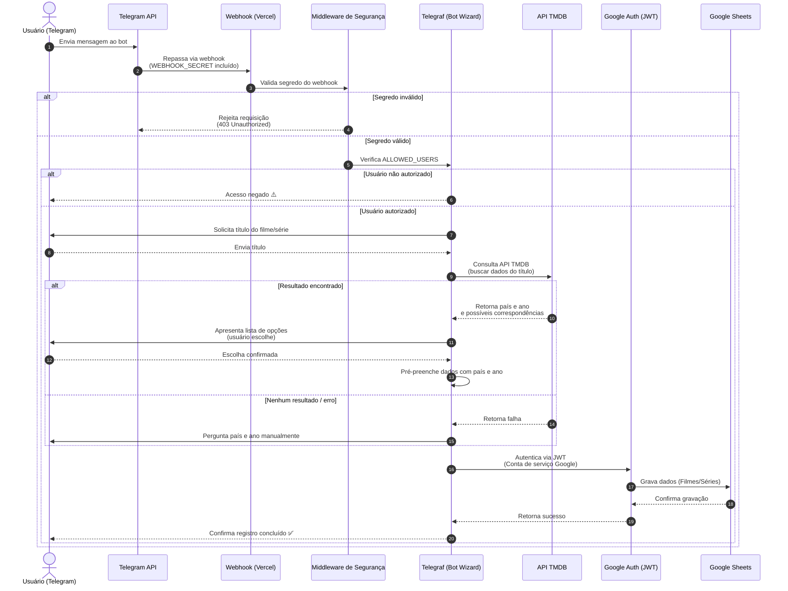

# Pais Cansados Bot 🍿

Um bot do Telegram simples e eficiente construído com Node.js (rodando on-demand via Webhooks Serverless na Vercel) para ajudar a família a registrar de forma automatizada e guiada os filmes e séries assistidos em uma planilha do Google Sheets.

## Funcionalidades
- **Fluxo de Conversação Interativo (Wizard):** O bot guia o usuário fazendo uma pergunta de cada vez (Nome, Origem, Nota, Lançamento, Onde viram, etc).
- **Separação Inteligente:** Lida com a entrada de "Filmes" e "Séries" de formas diferentes, direcionando os dados para abas distintas no Google Sheets e fazendo perguntas específicas (como temporara para Séries).
- **Arquitetura _Stateless_ e Serverless:** Configurado como um Webhook da Vercel (`api/webhook.js`). O bot "acorda" apenas quando recebe uma mensagem, garantindo **custo zero** de hospedagem e alta performance.
- **Tratamento Robusto de Chaves:** Implementado com um *parser* customizado que lida muito bem com quebras de linha e strings JSON formatadas da chave privada do Google Cloud, algo que costuma ser um pesadelo em painéis como o da Vercel.

## Tecnologias e Bibliotecas Utilizadas
- **[Node.js](https://nodejs.org/)** com formato *ES Modules* moderno.
- **[Telegraf](https://github.com/telegraf/telegraf)** para controle do bot do Telegram e gereciamento da cena (Wizard).
- **[Google Spreadsheet](https://theoephraim.github.io/node-google-spreadsheet)** e lib nativa **[Google Auth Library](https://github.com/googleapis/google-auth-library-nodejs)** para comunicação validada via JWT com o Google Sheets API.
- **[Vercel](https://vercel.com/)** para Deploy em produção gratuito com HTTPS nativo garantido (requisito do Webhook do Telegram).

## Segurança 🔒
- **Filtro de Acesso (Allowed Users):** Um middleware global garante que o bot não responda a estranhos da internet, restringindo o uso somente aos IDs do Telegram predefinidos no arquivo `.env`.
- **Webhook Securitizado:** A rota da Vercel foi configurada para não processar requisições "falsas" (que não venham do Telegram), exigindo um token secreto (`WEBHOOK_SECRET`) na URL chamada pelo Telegram.

## Arquitetura - diagrama de sequência macro



## Estrutura da Planilha Requerida
O arquivo Google Sheets referenciado precisará ter **duas abas criadas com exatamente estes nomes**:
1. `Filmes`
2. `Séries`

> **Importante:** A planilha precisa ser compartilhada (como Editora) com o e-mail da Conta de Serviço (Service Account) gerada no Google Cloud.

**As colunas preenchidas pelo script serão:**
- Nome
- Origem 
- Nota
- Lançamento *(Ano)*
- Temporada *(Exclusivo para aba de Séries)*
- Onde vimos
- Mês

## Integração com TMDB 🎥

Para facilitar o preenchimento dos dados, o bot conta com uma integração opcional à API pública do [TMDB (The Movie Database)](https://www.themoviedb.org/documentation/api).

Assim que o usuário informa o título de um filme ou série o bot tenta buscar registros correspondentes no TMDB e, quando encontra, pré‑preenche automaticamente o *país de origem* e o *ano de lançamento*. Caso haja vários resultados, uma lista de opções é apresentada para escolha; se nada for encontrado ou ocorrer algum erro, a pergunta passa a ser feita manualmente.

Para ativar essa funcionalidade é necessário adicionar também a chave de API do TMDB às variáveis de ambiente (você pode obter uma em https://www.themoviedb.org/settings/api):

```bash
TMDB_API_KEY=chave_do_tmdb_aqui
```

> **Nota:** o bot continuará funcionando mesmo sem a variável `TMDB_API_KEY`, mas exigirá que país e lançamento sempre sejam informados pelo usuário.

## Configuração do Ambiente Local (Desenvolvimento)

1. Clone o repositório e instale as dependências:
   ```bash
   npm install
   ```
2. Crie um arquivo `.env` na raiz do projeto copiando a estrutura de `.env.example` e preencha com as suas próprias chaves e IDs:
   - `TELEGRAM_BOT_TOKEN`: Gerado no Telegram via @BotFather.
   - `GOOGLE_SHEETS_DOCUMENT_ID`: O ID do documento na URL do Google Sheets.
   - `GOOGLE_SERVICE_ACCOUNT_EMAIL`: O e-mail da sua conta de serviço GCP.
   - `GOOGLE_PRIVATE_KEY`: A chave privada inteira.
   - `ALLOWED_USERS`: Lista de IDs do Telegram (separados por vírgula) que podem usar o bot (Ex: `1234567,9876543`).
   - `TMDB_API_KEY`: Chave de API do TMDB (opcional, usada para auto‑preenchimento de origem/ano).
   - `WEBHOOK_SECRET`: Uma senha forte qualquer (Ex: `uma_senha_muito_louca`) que será passada na URL do Webhook do Telegram.
3. Para testar modificações no script ou realizar debugs visuais, recomenda-se a utilização do ambiente dev da Vercel.
   ```bash
   vercel dev
   ```

## Deploy e Setup em Produção (Vercel)
Para subir o bot em Cloud gratuitamente siga os passos de configuração do Webhook:

1. Realize o deploy rodando no terminal do projeto o comando de produção da CLI:
   ```bash
   vercel --prod
   ```
2. Acesse o [Painel da Vercel](https://vercel.com), vá até seu projeto > **Settings > Environment Variables** e cadastre as 4 chaves citadas anteriormente. Tendo inserido as chaves, faça um **Redeploy** para o cache ser reconstruído e injetar essas variáveis na nuvem.
3. Configure o Webhook do Telegram rodando a seguinte URL de registro no seu navegador:
   ```
   https://api.telegram.org/bot<SEU_TOKEN_TELEGRAM_AQUI>/setWebhook?url=https://<SUA_URL_FINAL_DA_VERCEL>/api/webhook?webhook_secret=<SUA_SENHA_AQUI>
   ```
   O envio estará completo quando o navegador exibir `Webhook was set`.

---
🎬 Desenvolvido para facilitar a vida de pais cansados que querem documentar o que assistem de uma forma ágil! 🍿💤
